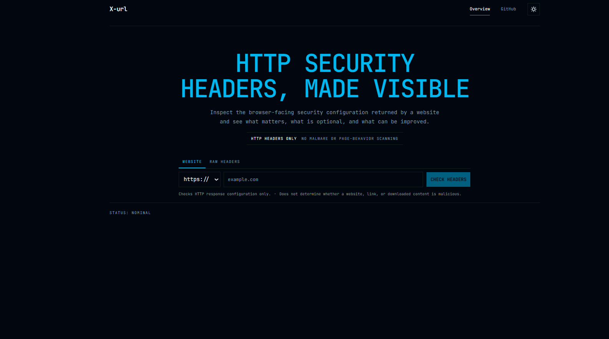

# X-url

## Website Security URL Analyzer

X-url is a simple web security analysis tool that checks a website URL and identifies important security configuration issues.

The main goal of X-url is to help developers and security learners quickly understand whether a website has basic security protections enabled.

---

You give X-url a website URL.

## 🎥 X-url Demo

This video demonstrates the X-url website security analysis workflow.

[▶️ Watch the X-url Demo](image/DEMO.mp4)

To use : Install the project as a zip then extract and open on vs code or any environment

Install the requirements:

           python -r install requirements.txt

Terminal 1: backend

              python -m uvicorn main:app --reload

Terminal 2: frontend

              npm install
              npm run dev  
